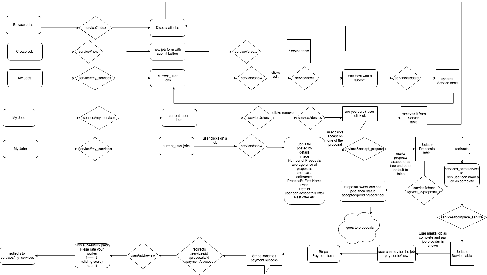
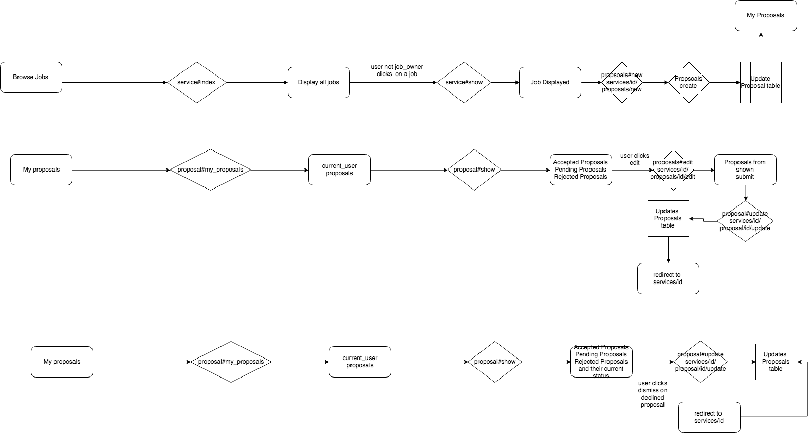
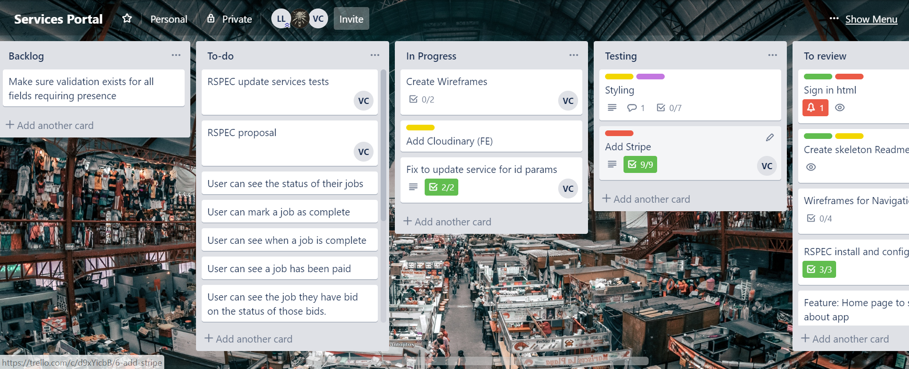

# Readme

## Links
* [App](https://better-services-portal.herokuapp.com/)
* [Repository](https://github.com/loui7/services-portal)

## Installation & Setup
Prerequisites & Versions Tested With
* ruby v2.6.3
* bundler v1.17.3
* PostgreSQL v11.3

Run the following commands in order.
`git clone https://github.com/loui7/services-portal.git`
`cd services-portal`
`bundle install`
`cp ./config/database.example.yml ./config/database.yml`
You will need to edit database.yml to correspond with your database credentials, then proceed.
`rails db:create`
`rails db:schema:load`

(OPTIONAL: This loads example data into your database.)
`rails db:seed`

## Identify the problem you’re trying to solve by building this particular marketplace app, and why it is a problem that needs solving
The ‘gig economy’ has rapidly grown in recent years as technology has enabled people to directly connect with each other and exchange their services. This growth is driven by the efficiency that cutting out the middleman by automating it with technology allows. Services Portal will use technology in this way specifically to connect businesses with short term jobs and the workers who want to complete them.

Other marketplaces for short term jobs that currently exist and are particularly popular like craigslist and gumtree don’t have review systems which directly demonstrate the legitimacy of a participant in a transaction.

Services Portal has such a ratings system, incentivising workers to do the best job they can so they’ll be picked for more jobs in the future.

## Describe the network infrastructure the app may be based on
Heroku is a managed application hosting architecture service. That means they handle all of the physical hardware set-up and basic operating system management. In the case of Heroku, they have on their servers a lot of small virtual servers called ‘dynos’. When you create a project on Heroku is is assigned one of these virtual servers and that is where your application runs and where requests sent to your application URL will be routed.

## Identify and describe the software to be used in your app
* Stripe - 3rd party payment processor, detailed below
* Cloudinary - 3rd party image hosting service, detailed below
* Devise - 3rd party user authentication, detailed below
* Rspec - testing suite, detailed below
* Ruby on Rails, HTML, CSS, JavaScript - logic, presentation and functionality of website
* PostgreSQL - database, detailed below

## Detail any third party services that your app will use
* Stripe
  * We are using Stripe in our Service Portal app to enable user_owners to pay user_providers for their work. It a future iteration we would have Stripe also pay Service Portal a percentage of that payment to fulfil the revenue side of Service Portal.
  * Provides security online payment for business. 
  * Satisfies the security requirements for businesses, meaning businesses don’t have the headache of meeting the requirements themselves. SCA requirements met to minimize the number of times a customer need to authenticate (3D Secure2)
  * Customer’s can create a wallet to securely store their data, if they so wish.  
  * Stripe minimizes risks; reduces fraud and increases Credit Card company acceptance of payments through metadata compliances that allow the Credit companies to efficiently accept or decline transactions.
  * Stripe will take payments, pay third parties or as in our case pay percentage to our business platform. 
  * Stripe advises it works across different browsers and screen sizes and with all major credit cards.
  * Stripe has a Custom UI kits that allows you to customise the payment input form. 
  * It will track payments.  It can handle once of payments and scheduled or subscription payments.
  * Allows you to create an in-person Point-of-sale terminal to accept payment in person and at site, ie, at the customer location for a job performed (like build a fence, or repairs to a house) a customer location. 
  * Stripe has platforms that help businesses with infrastructure to enable them to get started, i.e, like billing, integrate stripe into your business, allows for easier resolution of disputes. 
  * Provides detailed reporting that integrates with your Company’s accounting, that can also be customized and personalized to a business (i.e; logos, colour, styling).  The detailed reports hold the details you need for easier and simpler reconciliation, no more cross reconciliation needed with your bank and credit card statements.
  * Stripe offer reporting and insights for different currencies, payments compliant for different countries.

* Cloudinary
  * We are using Cloudinary in our Service Portal app to enable user_owners to include pictures when creating their job if this better illustrates the work they need proposals on.
  * Cloudinary gives you once place to store all your assets, images, audio, video, and documents.  Also pdf, psd, gif, 3D are just some of the other assets types it can store.
  * Enables access across computer, phone and tablet.
  * Asset Libraries can be accessed directly when using Adobe Photoshop, InDesign, or Illustrator.
  * Cloudinary allows your users to upload images from anywhere, on any device, when you include their upload widget in your website or App.
  * Cloudinary allows you to include an upload preview, progress bar, and an ability to upload multiple files at once.
  * Cloudinary offers a lot of Add-ons to improve performance, optimizing search, improve user interactions with your application, take a look as their will be an Add-on to suit your businesses’ needs.

* Devise
  * We are using Devise on our Services Portal application to handle user registration, authentication, and securely storing this sensitive information. 
  * Devise allows you to customize to your needs through modules.
  * It allows you to set up an asynchronous email delivery system.
  * Allows you to setup password strength, allow you to add it to client side.

* Rspec
  * We are using Rspec for testing of Services Portal.
  * Rspec is written in ruby to test ruby code.  It is a more simple testing platform as you are able to use plain speech term to formulate your test code methods.
  * You could also use mini.test to test your ruby code. Tests are constructed in a slightly more difficult format but still in a format that you can become accustomed to and use if so desired.
  * I have come to understand that rspec is extensively used by programmers to test their ruby code or applications written in ruby on rails.

## Identify the database to be used in your app and provide a justification for your choice
We chose to use PostgreSQL as the database for this project because it's performance and advanced features mean that no matter how much data our service ends up passing through it and complicated operations we want to perform, it would remain the best database choice just with some modifications.

The other main database technologies we considered using are SQLite & MySQL.

SQLites functionality might be adequate for an Minimum Viable Product, but it is not designed for larger and more complicated datasets so it is likely we would need to change at some point were Services Portal to gain a sizeable user base.

MySQL would have been a fine choice for this project, as it for the most part has the same functionality as PostgreSQL. However, it does have slightly fewer features than PostgreSQL, especially on the free tier (as they also offer paid licences). Development on it has also slowed down in recent years compared to PostgreSQL.

PostgreSQL also did recieve some preferential treatment simply because it's the only database we are all as a team familiar with.

## Describe the architecture of your app
### Models/Tables
* User
  * The user model will handle user authentication, and own both services and proposals The user will exist to provide an anchor for the functions of the website.
* Service
  * The service will exist to define a request from a user. This will allow other users to issue proposals to perform the job for a price.
* Proposal
  * Proposals will belong to both users and services. These will be displayed to the owner of a service, after which the owner may accept a proposal.

### Routes
We opted to use a nested resources approach to maintain a sensible approach that reflected the relationships between services and proposals. This means that we enforce presence and naming for parameters required by controller actions.

## Explain the different high-level components in your app
Login Components

Service Components

Proposals Components

## Describe (in general terms) the data structure of marketplace apps that are similar to your own.
The most similar app to ours would be Airtasker. Their data structure is very similar to our own, where users can put up advertisements for jobs they want completed, and other users can bid on those jobs. They also have added complexity where the poster of a job advertisement can set a budget for the job.

## Provide user stories for your app
* User
  * I can create an account, log in and out, edit and cancel my account
* Service Owner
  * I can request a service and provide details about that service
  * I can modify a service's details or remove the service request so long as I haven't yet accepted a proposal
  * I can peruse proposals made to my service and view the proposal owner's rating and proposal details
  * I can accept another user's proposal
  * I can mark a service as having been completed
  * I can pay the person who provided the service
  * I can leave a rating for the person who provided the service
  * I can browse my current service requests 
* Service Provider
  * I can browse existing job requests that are accepting proposals
  * I can make, edit or remove a proposal, so long as it hasn't been either accepted or rejected
  * I can see the number of proposals on a job and the average proposal value, in order to make a competitive offer
  * I can receive payment for providing a service

## Provide wireframes for your app
Mockup Navigation Wireframe

Application Navigation Wireframe

Mockup Service Wireframe

Application Service Wireframe

Mockup Proposal View

Application Proposal View

## Describe the way tasks are being planned and tracked in your project
We made use of Trello and verbally assigning tasks and agreeing on which parts of the app we would work on individually.

## Discuss how agile methodology is being implemented in your app
Daily discussions where applicable and use of Trello to organise individual work. Given the lack of clients, a good portion of agile methodology was rendered moot, as project specifications were never going to be subject to change.

For this project Isaac, Louis and Vic are both the client and designers of Services Portal.  In our discussions, options for our project all boiled down to a services platform of one kind or another.  We quickly decided on general service platform and not a specific service platform, like Puppy Pal or Formal Dress Service.  This brought simplicity, broaden our scope, would appeal to a broader market, and gave us, a clear direction to move forward.  

In the Design process, once we had the clear brief and approval of our App we talked about and wrote User Stories using Trello.  We quickly decided on our MVP and what might be for future iterations.  Our User stories and what a user could do only improved functionality and what a user could do over the time of the project.  The User stories lead to creating job cards and breaking up of work.  Some of our jobs cards where broken down further into small chunks of work.  

In our Design process we created User Stories, and ERD diagram for the database table we thought we needed and the data we needed to keep in each table.  Creating the ERD quickly showed that the User table and the Proposals table were both linked through the Services table. This lead to working our relationships between tables. We develop wireframes that show cased what was needed in our top nav (user interaction), a side nav (appearing once a user in signed in) and what user interaction would be available on what pages and through which user interactions (cascading menu/user actions).  Developing a high level diagram highlighted the architecture of the code we were developing. We quickly decide one User table as this would  improve user experience.  

While we only have one User table a user can be both a job creator and a proposal bidder.  Defining each user type was defined by table that user’s data would go to or affect, hence a @Services.user and a @Proposals.user.

We quickly decided Louis to be the Github and Heroku owner. Planning out the work and who would do the work was done through trello.  We using feature branches in Github.  Initially we agreed two members of the team approve a pull request of a feature branch.  This changed over time to 1 member’s approval to merge a feature branch to improve productivity.  Our team locationality and timeframe available to work on the project were not always the same or co-located.  This brought with it some issues around productivity.  We all did our best to always keep the project moving forward in some way code or documentation.

Trello, Slack, github were all key to communication and management of our project.  We assigned ourselves to a trello card we were working on and clearly named feature branches.  We tried to keep the work each of us was doing separate, but as our services and proposals tables were so closely linked this too brought about some issues to overcome. We did Daily catch ups/stand ups everyday some or all us of could be present.

Progress was always measured by demonstrated working code. We used Rspec, code reviews and testing user interaction with the application to determine code progress and success. 

Working on code, diagrams and documentation happen simultaneously. 

In an effort to producing sustainable and iterative, incremental and evolutionary code. We always worked out what’s next? What’s working? What needs adjusting or fixing? What do we want  to implement next? What does a user expect to be able to do after this? What does a user want to see in relation to this action?

Through the development of our application we made changes to design to better improve user experience on different pages. We had discussions on how code might be improved and how an action might be better placed.

Trello Screenshots

[Live Board](https://trello.com/b/BokYDYiQ)

## Provide an overview and description of your source control process
We made use of Git/GitHub to manage our codebase. We made agreements on how we would use the platform as a team (merging master rather than rebasing) and ensuring that we sought approval for pull requests before merging. We also agreed that the person making the pull request be responsible for merging their work into master.

## Provide an overview and description of your testing process
Manual testing was used frequently, especially when reviewing another's pull request. Rspec tests were also defined in './spec'. To see the results of Rspec tests, run `bundle exec rspec`

## Discuss and analyse requirements related to information system security
Using Devise for authentication and Cloudinary for image hosting takes much of the work related to security out of our hands. Still there is need to be wary of malicious users - the most prominent for us was that despite hiding buttons exposed to users, it is still possible to fire off requests to the server. This could result in undesirable behaviour, and can be circumvented by implementing checks at the controller and/or model level to ensure that the data being processed is indeed valid.

Another security measure worth considering is the implementation of a positive or negative CAPTCHA in an effort to mitigate bot attacks. Given the nature of this as an assignment rather than a fully fledged project, it may be enough to implement only a negative CAPTCHA.

## Discuss methods you will use to protect information and data
Again with using Devise, there is much that is hidden from us as. One consideration is Rails logging, we may decide to implement parameter filtering in Rails logs. It is worth mentioning that research has yielded that the Devise gem will by default expire sessions on sign in and sign out, which is a countermeasure for session fixation.

## Research what your legal obligations are in relation to handling user data
First and foremost we should have an accessible privacy policy. This would make clear our intentions for any user data, especially considering we do collect private phone numbers. Handing off payment processing to Stripe mitigates our responsibilities in this department, but shouldn't mitigate the care we take in handling what data we do collect. We should also consider ensuring that we encrypt any backups to ease compliance with "right to be forgotten" GDPR requirements should we deploy the solution globally.

## Provide your database schema design
* 

## Discuss the database relations to be implemented
The database relations have been implemented as Primary and Foreign key relationships between tables.
The primary key is autogenerated by PostGres as an 'id' column in the Services table, and is used as the primary key between tables.
Foreign keys have been created between each table in the following form:
* Service 1 to many with Proposal using service id as the main relationship
* Service and Proposals as 1 to many to User table using user id as the main relationship

## Describe your project's models in terms of the relationships (active record associations) they have with each other
* User - has many Services and Proposals
* Service - belongs to User. Has many Proposals
* Proposal - belongs to both a User and a Service
